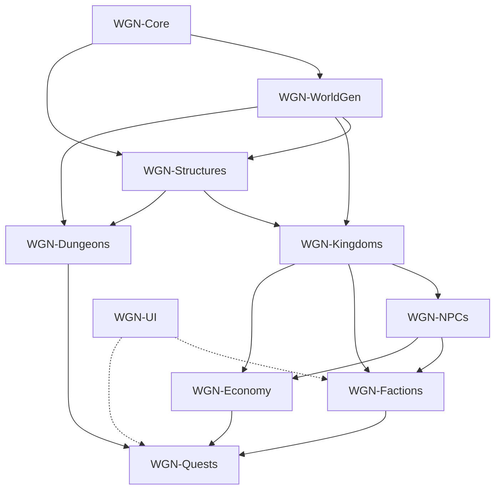

# WGN Architecture

## Overview

World Generation Nexus (WGN) is organized as a single Fabric mod with logically separated modules. Each module implements `WgnModule` and registers with `ModuleRegistry`, which performs dependency-ordered initialization at startup.

```
WGN (ModInitializer)
  └── ModuleRegistry
        ├── WGN-Core
        ├── WGN-WorldGen
        ├── WGN-Structures
        ├── WGN-Kingdoms
        ├── WGN-NPCs
        ├── WGN-Dungeons
        ├── WGN-Factions
        ├── WGN-Economy
        └── WGN-Quests

WGNClient (ClientModInitializer)
  └── WGN-UI
```

## Design Principles

1. **Modular** — Subsystems are isolated behind module boundaries with explicit dependencies.
2. **Scalable** — Modules can later be extracted into Gradle subprojects or separate jars.
3. **Registry-driven** — Features register through central registries rather than hard-coded wiring.
4. **Data-driven** — Structures, palettes, civilizations, and dungeons are defined in data packs where possible.
5. **Enterprise quality** — Clear contracts, dependency ordering, and separation of server/client logic.

## Module Dependency Graph



## Module Responsibilities

### WGN-Core

- `WgnModule` contract
- `ModuleRegistry` topological bootstrap
- Shared constants and cross-cutting utilities

### WGN-WorldGen

- Chunk generation hooks
- Biome integration
- Exploration discovery pipeline

### WGN-Structures

- Structure blueprint storage (target: 100k+ templates)
- `MaterialPalette` — civilization-aware block palettes
- Procedural combination of template pieces

### WGN-Kingdoms

- `CivilizationType` archetypes
- Jigsaw-based kingdom layout
- District, road, and expansion systems

### WGN-NPCs

- `NpcRole` definitions
- Behavior trees: walk, sleep, eat, work, trade, travel, defend

### WGN-Dungeons

- `DungeonType` archetypes
- Loot, boss, puzzle, and trap room generation

### WGN-Factions

- Per-faction reputation tracking
- Action memory (help, attack, trade)

### WGN-Economy

- Market simulation
- NPC trade integration

### WGN-Quests

- Reputation-gated quest lines
- World-event-driven adventures

### WGN-UI (client)

- Reputation and faction displays
- Quest journal
- Kingdom/exploration overlays

## Data Layout (planned)

```
src/main/resources/data/wgn/
  structures/       # Blueprint definitions
  civilizations/    # Kingdom archetype configs
  dungeons/         # Dungeon templates
  npcs/             # Role and behavior data
  factions/         # Faction definitions
  quests/           # Quest chains
```

## Roadmap

| Phase | Focus |
|-------|-------|
| **0.1** | Scaffold, module registry, project structure |
| **0.2** | WorldGen chunk hooks, basic biome features |
| **0.3** | Structure template loader, first palettes |
| **0.4** | Kingdom jigsaw prototype, road graph |
| **0.5** | NPC entity prototype, basic routines |
| **1.0** | Playable alpha with one full civilization loop |
